

# 🎨 Fleasion Modpack for Rivals

**A drag-and-drop asset pack for [Fleasion](https://github.com/fleasion/Fleasion) — swap sounds, skins, skyboxes, wraps, and textures in Roblox Rivals.**

---

## 🖼️ Texture Pack

Click on the texture you want to download.

<table>
<tr>
<td align="center" width="50%">
 
<b>3-F Textures</b>
</td>
<td align="center" width="50%">
 
<b>DETERMINATION Textures</b>
</td>
</tr>
<tr>
<td align="center">
 
<b>Gray Arena Textures</b>
</td>
<td align="center">
 
<b>Hella Expensive Wall Textures</b>
</td>
</tr>
<tr>
<td align="center">
 
<b>Minecraft Textures</b>
</td>
<td align="center">
 
<b>Mirc's Textures</b>
</td>
</tr>
<tr>
<td align="center">
 
<b>No Textures</b>
</td>
<td align="center">
 
<b>Scribble Textures</b>
</td>
</tr>
<tr>
<td align="center">
 
<b>Teal Pattern Arena Textures</b>
</td>
<td align="center">
 
<b>Tism Textures (Pack)</b>
</td>
</tr>
</table>

---

## ☁️ Skyboxes

Click on the sky you want to download.

<table>
<tr>
<td align="center" width="50%">
 
<b>Heaven</b>
</td>
<td align="center" width="50%">
 
<b>Pink Sky</b>
</td>
</tr>
<tr>
<td align="center">
 
<b>Custom Sky</b>
</td>
<td align="center">
 
<b>Realistic Sky</b>
</td>
</tr>
<tr>
<td align="center">
 
<b>Cloudy Sky</b>
</td>
<td align="center">
 
<b>Jungle Sky</b>
</td>
</tr>
</table>

**More skyboxes (no preview image yet):** [Classic Skybox](sky/Classic%20Skybox.json) • [Purple SkyBox](sky/Purple%20SkyBox.json) • [purple sky](sky/purple%20sky.json) • [monochrome sky](sky/monochrome%20sky.json) • [skies (all-in-one)](sky/skies.json) • [sky all maps rivals](sky/sky%20all%20maps%20rivals.json)

---

## 🔫 Weapon Skins

Click a weapon category to expand it, then a weapon type. Skins with a preview show as a clickable thumbnail; the rest are listed below as plain links.

<b>🔫 Primary</b>

  

  
<b>Assult Rifle</b> (7)

  

  <table>
  <tr>

  <td align="center" width="25%">
  <a href="skins/primary/Assult%20Rifle/Aug%20On%20Default%20with%20more%20skins.json">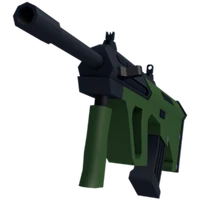</a> 
  Aug On Default with more skins
  </td>

  <td align="center" width="25%">
   
  Gingerbread Aug over Aug
  </td>

  <td align="center" width="25%">
  <a href="skins/primary/Assult%20Rifle/Tommy%20On%20Default.json">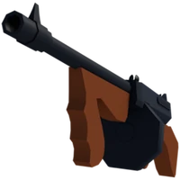</a> 
  Tommy On Default
  </td>

  <td align="center" width="25%">
  <a href="skins/primary/Assult%20Rifle/ak-47.json">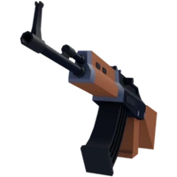</a> 
  ak-47
  </td>

  </tr>
  <tr>

  <td align="center" width="25%">
  <a href="skins/primary/Assult%20Rifle/akey-47.json">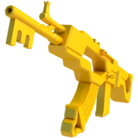</a> 
  akey-47
  </td>

  <td align="center" width="25%">
  <a href="skins/primary/Assult%20Rifle/boneclaw%20assault%20rifle.json">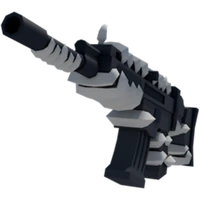</a> 
  boneclaw assault rifle
  </td>

  <td align="center" width="25%">
  <a href="skins/primary/Assult%20Rifle/pearl%20rifle.json">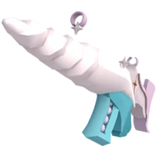</a> 
  pearl rifle
  </td>

  </tr>
  </table>
  

  

  

  
<b>Bow</b> (6)

  

  <table>
  <tr>

  <td align="center" width="25%">
  <a href="skins/primary/Bow/Batbow.json">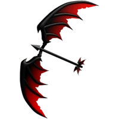</a> 
  Batbow
  </td>

  <td align="center" width="25%">
  <a href="skins/primary/Bow/DreamBow.json">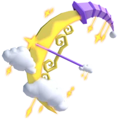</a> 
  DreamBow
  </td>

  <td align="center" width="25%">
  <a href="skins/primary/Bow/frostbite%20bow.json">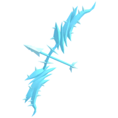</a> 
  frostbite bow
  </td>

  <td align="center" width="25%">
  <a href="skins/primary/Bow/keybow.json">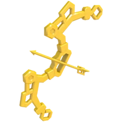</a> 
  keybow
  </td>

  </tr>
  </table>
  

  **More (no preview yet):** 
[minecraft bow](skins/primary/Bow/minecraft%20bow.json) • [tungbow](skins/primary/Bow/tungbow.json)

  

  

  
<b>Burst Rifle</b> (2)

  

  <table>
  <tr>

  <td align="center" width="25%">
  <a href="skins/primary/Burst%20Rifle/Pixel%20Burst.json">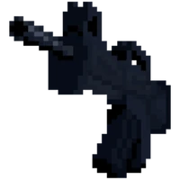</a> 
  Pixel Burst
  </td>

  <td align="center" width="25%">
  <a href="skins/primary/Burst%20Rifle/keyst.json">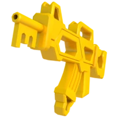</a> 
  keyst
  </td>

  </tr>
  </table>
  

  

  

  
<b>Crossbow</b> (1)

  

  <table>
  <tr>

  <td align="center" width="25%">
  <a href="skins/primary/Crossbow/arch%20crossbow%20%28No%20vfx%20I%20think%29.json">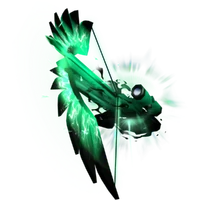</a> 
  arch crossbow (No vfx I think)
  </td>

  </tr>
  </table>
  

  

  

  
<b>GunBlade</b> (1)

  **More (no preview yet):** 
[cool gunblade (Custom)](skins/primary/GunBlade/cool%20gunblade%20%28Custom%29.json)

  

  

  
<b>Minigun</b> (2)

  

  <table>
  <tr>

  <td align="center" width="25%">
  <a href="skins/primary/Minigun/Fighter%20Jet.json">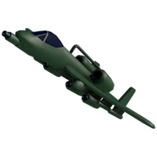</a> 
  Fighter Jet
  </td>

  </tr>
  </table>
  

  **More (no preview yet):** 
[plane](skins/primary/Minigun/plane.json)

  

  

  
<b>Paintball</b> (2)

  

  <table>
  <tr>

  <td align="center" width="25%">
  <a href="skins/primary/Paintball/Snowball.json">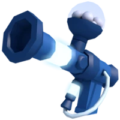</a> 
  Snowball
  </td>

  </tr>
  </table>
  

  **More (no preview yet):** 
[paintkey](skins/primary/Paintball/paintkey.json)

  

  

  
<b>RPG</b> (1)

  

  <table>
  <tr>

  <td align="center" width="25%">
   
  RPKEY
  </td>

  </tr>
  </table>
  

  

  

  
<b>Shotgun</b> (1)

  

  <table>
  <tr>

  <td align="center" width="25%">
  <a href="skins/primary/Shotgun/Baloonshotgun.json">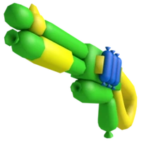</a> 
  Baloonshotgun
  </td>

  </tr>
  </table>
  

  

  

  
<b>Sniper</b> (6)

  

  <table>
  <tr>

  <td align="center" width="25%">
  <a href="skins/primary/Sniper/Event%20Horizon%20Sniper.json">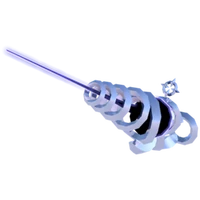</a> 
  Event Horizon Sniper
  </td>

  <td align="center" width="25%">
  <a href="skins/primary/Sniper/Keyper.json">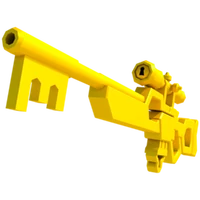</a> 
  Keyper
  </td>

  <td align="center" width="25%">
  <a href="skins/primary/Sniper/eye%20thing%20sniper.json">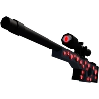</a> 
  eye thing sniper
  </td>

  <td align="center" width="25%">
  <a href="skins/primary/Sniper/kraken%20sniper.json">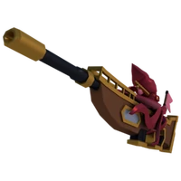</a> 
  kraken sniper
  </td>

  </tr>
  <tr>

  <td align="center" width="25%">
  <a href="skins/primary/Sniper/pixel%20sniper.json">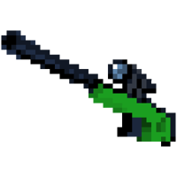</a> 
  pixel sniper
  </td>

  </tr>
  </table>
  

  **More (no preview yet):** 
[Pixel_Keyper](skins/primary/Sniper/Pixel_Keyper.json)

  

<b>🔪 Secondary</b>

  

  
<b>Daggers</b> (6)

  

  <table>
  <tr>

  <td align="center" width="25%">
  <a href="skins/Secondary/Daggers/Bat%20dagger.json">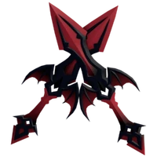</a> 
  Bat dagger
  </td>

  <td align="center" width="25%">
  <a href="skins/Secondary/Daggers/Daggers%20to%20Crystal%20Daggers.json">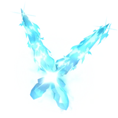</a> 
  Daggers to Crystal Daggers
  </td>

  <td align="center" width="25%">
  <a href="skins/Secondary/Daggers/aces%20maybe.json">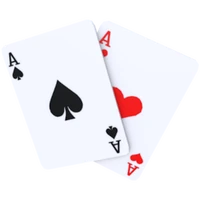</a> 
  aces maybe
  </td>

  <td align="center" width="25%">
  <a href="skins/Secondary/Daggers/keynais.json">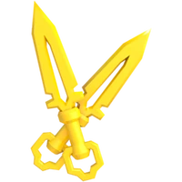</a> 
  keynais
  </td>

  </tr>
  </table>
  

  **More (no preview yet):** 
[arch daggers](skins/Secondary/Daggers/arch%20daggers.json) • [tungdag](skins/Secondary/Daggers/tungdag.json)

  

  

  
<b>Energy pistols</b> (2)

  

  <table>
  <tr>

  <td align="center" width="25%">
   
  Void Pistols
  </td>

  <td align="center" width="25%">
  <a href="skins/Secondary/Energy%20pistols/hyperlaser%20over%20default%20energy.json">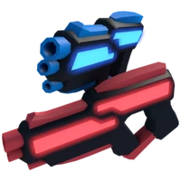</a> 
  hyperlaser over default energy
  </td>

  </tr>
  </table>
  

  

  

  
<b>Exo</b> (5)

  

  <table>
  <tr>

  <td align="center" width="25%">
  <a href="skins/Secondary/Exo/MidnightExogun.json">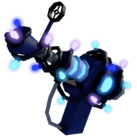</a> 
  MidnightExogun
  </td>

  <td align="center" width="25%">
  <a href="skins/Secondary/Exo/Singularity.json">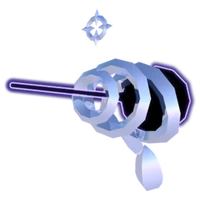</a> 
  Singularity
  </td>

  <td align="center" width="25%">
  <a href="skins/Secondary/Exo/pearl%20exo.json">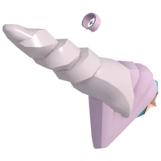</a> 
  pearl exo
  </td>

  <td align="center" width="25%">
   
  singularity exo
  </td>

  </tr>
  </table>
  

  **More (no preview yet):** 
[portal gun exogun](skins/Secondary/Exo/portal%20gun%20exogun.json)

  

  

  
<b>Hand gun</b> (4)

  

  <table>
  <tr>

  <td align="center" width="25%">
   
  Gumball Handgun
  </td>

  <td align="center" width="25%">
  <a href="skins/Secondary/Hand%20gun/Pixelhandgun%20%281%29.json">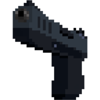</a> 
  Pixelhandgun (1)
  </td>

  <td align="center" width="25%">
  <a href="skins/Secondary/Hand%20gun/Stealth%20Pistol.json">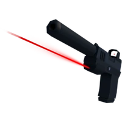</a> 
  Stealth Pistol
  </td>

  </tr>
  </table>
  

  **More (no preview yet):** 
[key handgun](skins/Secondary/Hand%20gun/key%20handgun.json)

  

  

  
<b>Revolver</b> (3)

  

  <table>
  <tr>

  <td align="center" width="25%">
  <a href="skins/Secondary/Revolver/Uh%20boneclaw%20rev.json">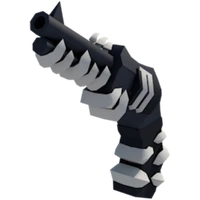</a> 
  Uh boneclaw rev
  </td>

  <td align="center" width="25%">
  <a href="skins/Secondary/Revolver/keyrev.json">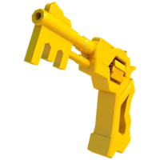</a> 
  keyrev
  </td>

  </tr>
  </table>
  

  **More (no preview yet):** 
[GlassCannon](skins/Secondary/Revolver/GlassCannon.json)

  

  

  
<b>Slingshot</b> (1)

  **More (no preview yet):** 
[key sling over normal sling](skins/Secondary/Slingshot/key%20sling%20over%20normal%20sling.json)

  

  

  
<b>Spray</b> (2)

  

  <table>
  <tr>

  <td align="center" width="25%">
  <a href="skins/Secondary/Spray/key%20spray.json">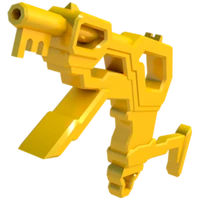</a> 
  key spray
  </td>

  <td align="center" width="25%">
  <a href="skins/Secondary/Spray/spray%20bottle.json">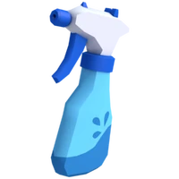</a> 
  spray bottle
  </td>

  </tr>
  </table>
  

  

  

  
<b>Uzi</b> (2)

  

  <table>
  <tr>

  <td align="center" width="25%">
  <a href="skins/Secondary/Uzi/keyzi.json">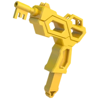</a> 
  keyzi
  </td>

  </tr>
  </table>
  

  **More (no preview yet):** 
[archuzi](skins/Secondary/Uzi/archuzi.json)

  

<b>⚔️ Melee</b>

  

  
<b>Battle Axe</b> (2)

  

  <table>
  <tr>

  <td align="center" width="25%">
  <a href="skins/Melee/Battle%20Axe/NordicAxe.json">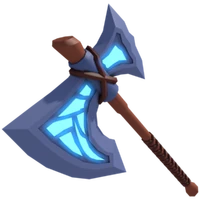</a> 
  NordicAxe
  </td>

  <td align="center" width="25%">
  <a href="skins/Melee/Battle%20Axe/keyttle%20%28Key%20Battle%20Axe%29.json">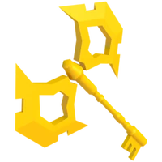</a> 
  keyttle (Key Battle Axe)
  </td>

  </tr>
  </table>
  

  

  

  
<b>Chainsaw</b> (1)

  

  <table>
  <tr>

  <td align="center" width="25%">
   
  CHAINSAW-BUZ
  </td>

  </tr>
  </table>
  

  

  

  
<b>Fist</b> (3)

  

  <table>
  <tr>

  <td align="center" width="25%">
  <a href="skins/Melee/Fist/brass.json">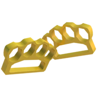</a> 
  brass
  </td>

  <td align="center" width="25%">
  <a href="skins/Melee/Fist/pumpkinfist%20over%20boxing%20gloves.json">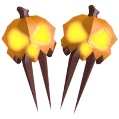</a> 
  pumpkinfist over boxing gloves
  </td>

  </tr>
  </table>
  

  **More (no preview yet):** 
[emo punk arm](skins/Melee/Fist/emo%20punk%20arm.json)

  

  

  
<b>Katana</b> (8)

  

  <table>
  <tr>

  <td align="center" width="25%">
  <a href="skins/Melee/Katana/arch%20katana.json">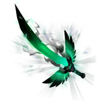</a> 
  arch katana
  </td>

  <td align="center" width="25%">
  <a href="skins/Melee/Katana/crystal%20katana.json">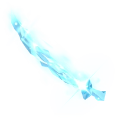</a> 
  crystal katana
  </td>

  <td align="center" width="25%">
  <a href="skins/Melee/Katana/keytana.json">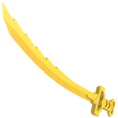</a> 
  keytana
  </td>

  <td align="center" width="25%">
  <a href="skins/Melee/Katana/linked%20sword.json">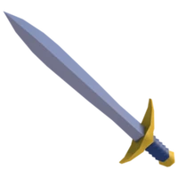</a> 
  linked sword
  </td>

  </tr>
  <tr>

  <td align="center" width="25%">
  <a href="skins/Melee/Katana/riptide%20%281%29.json">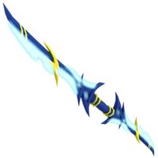</a> 
  riptide (1)
  </td>

  <td align="center" width="25%">
  <a href="skins/Melee/Katana/saber%20over%20default%20katana.json">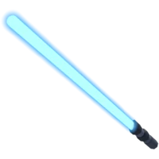</a> 
  saber over default katana
  </td>

  </tr>
  </table>
  

  **More (no preview yet):** 
[Devil's trident katana](skins/Melee/Katana/Devil%27s%20trident%20katana.json) • [azure sword katana (custom)](skins/Melee/Katana/azure%20sword%20katana%20%28custom%29.json)

  

  

  
<b>Knife</b> (9)

  

  <table>
  <tr>

  <td align="center" width="25%">
   
  Candy cane (1)
  </td>

  <td align="center" width="25%">
  <a href="skins/Melee/Knife/Keyrambit.json">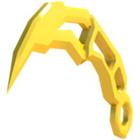</a> 
  Keyrambit
  </td>

  <td align="center" width="25%">
  <a href="skins/Melee/Knife/armature%20default.json">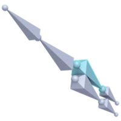</a> 
  armature default
  </td>

  <td align="center" width="25%">
  <a href="skins/Melee/Knife/caladbolg%20%28Anim%20only%20I%20think%29.json">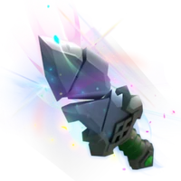</a> 
  caladbolg (Anim only I think)
  </td>

  </tr>
  <tr>

  <td align="center" width="25%">
  <a href="skins/Melee/Knife/keylisong%20over%20balisong.json">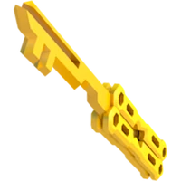</a> 
  keylisong over balisong
  </td>

  <td align="center" width="25%">
   
  pencil over default knife
  </td>

  </tr>
  </table>
  

  **More (no preview yet):** 
[Diamond Sword knife (custom)](skins/Melee/Knife/Diamond%20Sword%20knife%20%28custom%29.json) • [glast shard knife](skins/Melee/Knife/glast%20shard%20knife.json) • [tungknif](skins/Melee/Knife/tungknif.json)

  

  

  
<b>Maul</b> (1)

  

  <table>
  <tr>

  <td align="center" width="25%">
   
  BanHammer
  </td>

  </tr>
  </table>
  

  

  

  
<b>Riot</b> (2)

  

  <table>
  <tr>

  <td align="center" width="25%">
   
  EnergyShield
  </td>

  </tr>
  </table>
  

  **More (no preview yet):** 
[Invis riot](skins/Melee/Riot/Invis%20riot.json)

  

  

  
<b>Scythe</b> (9)

  

  <table>
  <tr>

  <td align="center" width="25%">
   
  Bug Net over Default Scythe
  </td>

  <td align="center" width="25%">
   
  Keythe over Default Scythe
  </td>

  <td align="center" width="25%">
   
  Palm Scythe
  </td>

  <td align="center" width="25%">
   
  anchor scythe
  </td>

  </tr>
  <tr>

  <td align="center" width="25%">
   
  bat scythe
  </td>

  <td align="center" width="25%">
   
  cryo
  </td>

  <td align="center" width="25%">
   
  crystal syth over normal syth (1)
  </td>

  <td align="center" width="25%">
   
  sakrua sycthe
  </td>

  </tr>
  </table>
  

  **More (no preview yet):** 
[scythe test](skins/Melee/Scythe/scythe%20test.json)

  

  

  
<b>Spear</b> (1)

  **More (no preview yet):** 
[Pencel](skins/Melee/Spear/Pencel.json)

  

<b>🎒 Utility</b>

  

  
<b>Greanade</b> (5)

  

  <table>
  <tr>

  <td align="center" width="25%">
   
  WaterBalloon (1)
  </td>

  <td align="center" width="25%">
   
  dynamite (grenade)
  </td>

  <td align="center" width="25%">
   
  keynade
  </td>

  </tr>
  </table>
  

  **More (no preview yet):** 
[dyna](skins/utility/Greanade/dyna.json) • [pumpkin nade](skins/utility/Greanade/pumpkin%20nade.json)

  

  

  
<b>Jumppad</b> (1)

  

  <table>
  <tr>

  <td align="center" width="25%">
   
  BouncyHouse (colorless)
  </td>

  </tr>
  </table>
  

  

  

  
<b>Medkit</b> (1)

  **More (no preview yet):** 
[KEYKIT](skins/utility/Medkit/KEYKIT.json)

  

  

  
<b>Mototv</b> (3)

  

  <table>
  <tr>

  <td align="center" width="25%">
   
  Arch Molotov green flame
  </td>

  <td align="center" width="25%">
   
  Arch Molotov red flame
  </td>

  <td align="center" width="25%">
   
  norm molly to vexed candle
  </td>

  </tr>
  </table>
  

  

  

  
<b>Satchel</b> (3)

  

  <table>
  <tr>

  <td align="center" width="25%">
   
  notebook satchel
  </td>

  </tr>
  </table>
  

  **More (no preview yet):** 
[Keychel (custom)](skins/utility/Satchel/Keychel%20%28custom%29.json) • [tungsat](skins/utility/Satchel/tungsat.json)

  

  

  
<b>WarHorn</b> (5)

  

  <table>
  <tr>

  <td align="center" width="25%">
   
  air horn (war horn)
  </td>

  <td align="center" width="25%">
   
  bone claw war horn
  </td>

  <td align="center" width="25%">
   
  mammoth warhorn
  </td>

  <td align="center" width="25%">
   
  megaphone war horn faced backwards
  </td>

  </tr>
  <tr>

  <td align="center" width="25%">
   
  trumpet (warhorn)
  </td>

  </tr>
  </table>
  

  

  

  
<b>Warpstone</b> (1)

  **More (no preview yet):** 
[EnderPearl (1)](skins/utility/Warpstone/EnderPearl%20%281%29.json)

  

  

  
<b>subspacetripmine</b> (2)

  

  <table>
  <tr>

  <td align="center" width="25%">
   
  DontPress
  </td>

  <td align="center" width="25%">
   
  spring over default
  </td>

  </tr>
  </table>
  

  

---

## 🎁 Wraps

Bubble wrap skins:

- [Glass](Wrap%20%28only%20for%20bubble%20wrap%29/glass.json)
- [Cherry Blossom](Wrap%20%28only%20for%20bubble%20wrap%29/cherry%20blossom%20wrap.json)

Find them in [`Wrap (only for bubble wrap)/`](Wrap%20(only%20for%20bubble%20wrap)).

---

## 🔊 Kill & Hit Sounds

- [Hit sounds](Kill%20and%20hit%20sound/Hit%20sounds.json)
- [MEOW sound (kill)](Kill%20and%20hit%20sound/MEOW%20sound%20KILL%20working.json)
- [Body kill](Kill%20and%20hit%20sound/body%20kill%20working.json)
- [Head hits](Kill%20and%20hit%20sound/head%20hits%20working.json)
- [Kill confirmation](Kill%20and%20hit%20sound/killllll.json)

Find them all in [`Kill and hit sound/`](Kill%20and%20hit%20sound).

---

## 🚀 How to use

1. Install [Fleasion](https://github.com/fleasion/Fleasion) (Windows, macOS, and Linux/Sober are all supported).
2. Download the configs you want.
3. Open Fleasion then click on open config it will bring you to config files then paste/move all downloaded config here.
4. go back to Fleasion click on [enabled] active the config you want to use.

---

## 📌 Others

- **All configs in this repository are collected from the community — none of them are made or owned by me.** Full credit goes to their original creators. This repo just organizes them for easy access.
- This pack only works with [Fleasion](https://github.com/fleasion/Fleasion), which performs **client-side only** asset replacement — other players never see your changes. Roblox has stated these modifications aren't officially permitted, so use at your own discretion.
- Released under the [MIT License](LICENSE).
